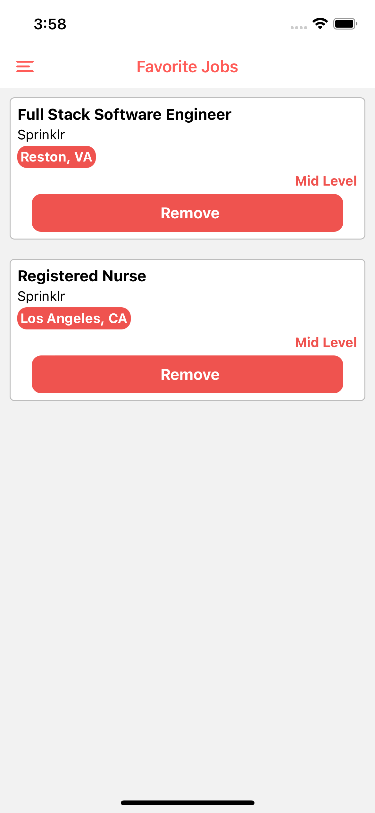

# KodWork2

Kodwork app for React-Native course on [Patika](https://app.patika.dev)

My second KodWork work. This one is my best practice.

# Here images of Application

    

# Tools & Resources

- [Lottie](https://github.com/lottie-react-native/lottie-react-native) for animation
- [React Navigation](https://reactnavigation.org/) for page hierarchy
- [.env](https://github.com/motdotla/dotenv) for Storing configuration in the environment separate from code
- [Axios](https://github.com/axios/axios) for data fetching.
- [babel-plugin-module-resolver](https://github.com/tleunen/babel-plugin-module-resolver) .
- [React-Native-config](https://github.com/luggit/react-native-config) .
- [Redux-Toolkit](https://redux-toolkit.js.org/) .

# Setup

- Install [React Native](https://reactnative.dev/docs/getting-started)
- Run on your terminal 'git clone https://github.com/bariskndmr/KodWork2.git'
- Run in root directory with terminal 'npm install'
- Run 'npx react-natice run-ios/run-android' when 'npm install' finished
